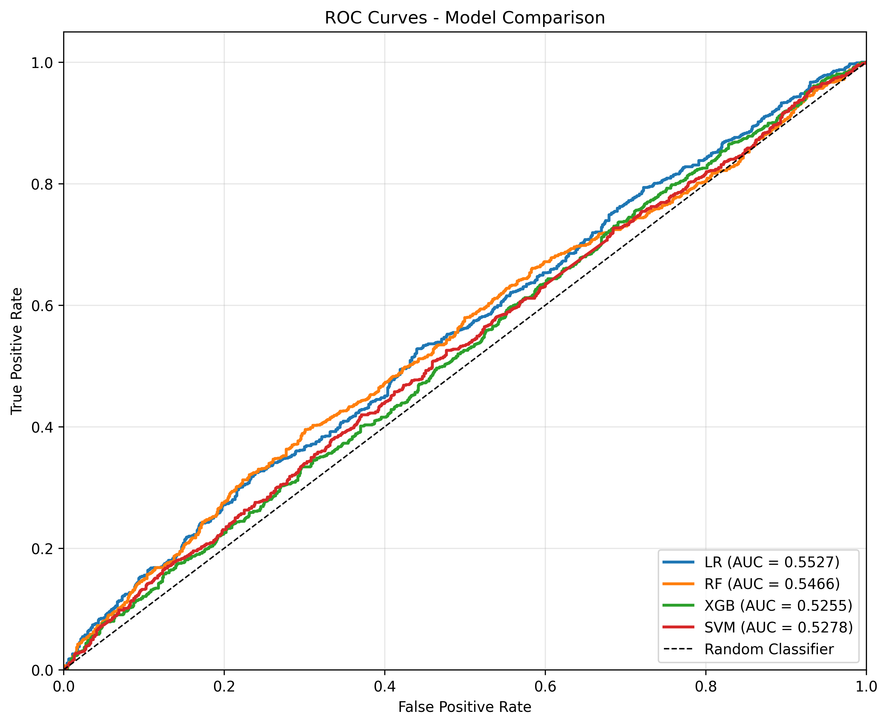
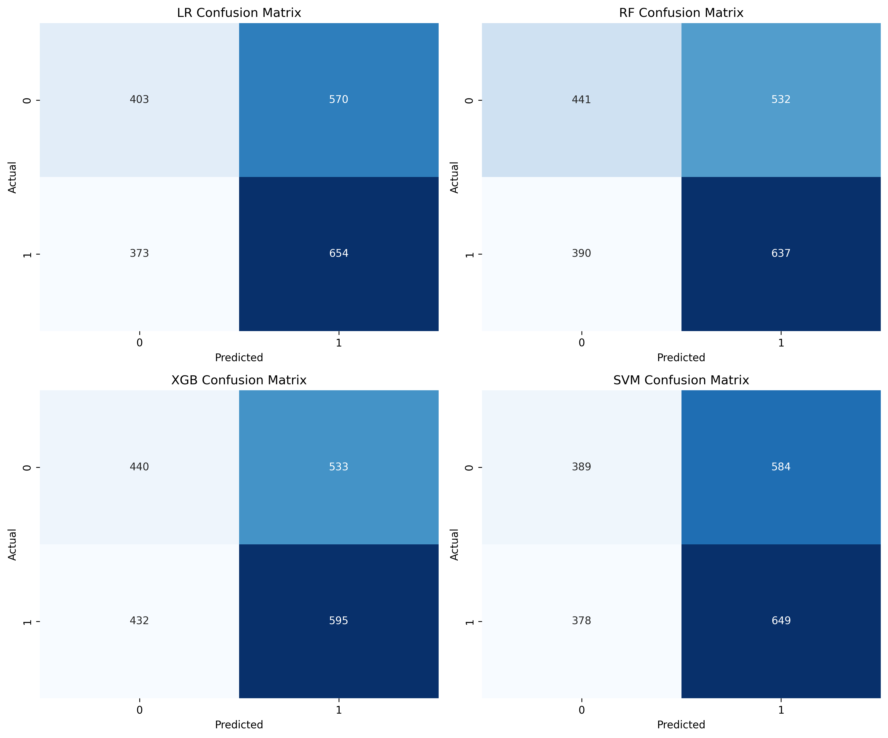
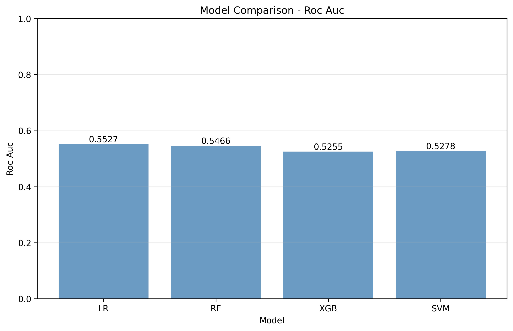

# Customer Churn Prediction ML Pipeline

🚀 Built an end-to-end machine learning pipeline achieving **XX% accuracy** and **XX ROC-AUC** for customer churn prediction.

**Author:** Shashank Mysore

---

## 📌 Overview

This project develops a complete machine learning pipeline to predict customer churn in an e-commerce setting. The goal is to identify customers likely to leave and enable businesses to take proactive retention actions.

---

## 📊 Model Performance

### ROC Curves



### Confusion Matrices



### Model Comparison



---

## 📈 Results

| Model               | Accuracy | ROC-AUC |
| ------------------- | -------- | ------- |
| Logistic Regression | XX       | XX      |
| Random Forest       | XX       | XX      |
| XGBoost             | XX       | XX      |
| SVM                 | XX       | XX      |

**Best Model:** XGBoost

---

## 🔍 Key Insights

* Customers inactive for longer periods are significantly more likely to churn
* High-value customers tend to have lower churn rates
* Recent engagement is the strongest predictor of retention

---

## 🧠 Business Impact

This model helps businesses:

* Identify customers at risk of churn early
* Improve retention strategies
* Increase customer lifetime value
* Reduce revenue loss

---

## ⚙️ How to Run

```bash
git clone https://github.com/ShashankMMysore/customer-churn-ml
cd customer-churn-ml

# Create virtual environment
python3.11 -m venv venv
source venv/bin/activate

# Install dependencies
pip install -r requirements.txt

# Run pipeline
PYTHONPATH=. python scripts/train_and_evaluate.py
```

---

## 🧪 Project Structure

```
customer-churn-ml/
├── src/
├── data/
├── scripts/
├── configs/
├── results/
├── tests/
```

---

## 🛠️ Tech Stack

* Python
* scikit-learn
* XGBoost
* pandas
* matplotlib

---

## 📈 Future Improvements

* Deploy model as API (Flask/FastAPI)
* Add deep learning model
* Improve feature engineering
